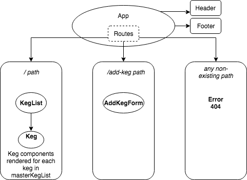

# Keg Room (React)

Simple web app for the management of keg inventory in a bar.

## Features

* Displays list of kegs currently available, along with properties (name, brand, price, alcohol content, pints remaining)
* Allows users to add additional kegs via form submission

## Setup

1. [Install Node.js and npm](https://www.npmjs.com/get-npm), if not already present in your local environment.
3. Clone this repository.
4. Within your preferred shell, navigate to the project folder and run ```npm install``` (this may take a moment to complete):

### Development server

Run `npm run start` for a dev server. Navigate to `http://localhost:8080/`. The app will automatically reload if you change any of the source files.

## License
This project is distributed under the MIT License - see the [LICENSE](LICENSE) file for details.

Copyright © 2018 Eric Swotinsky.


